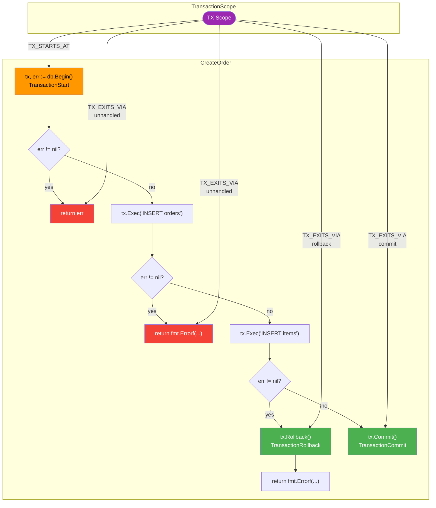
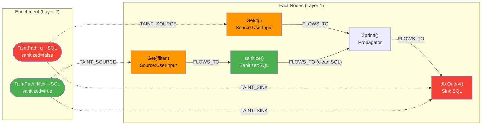
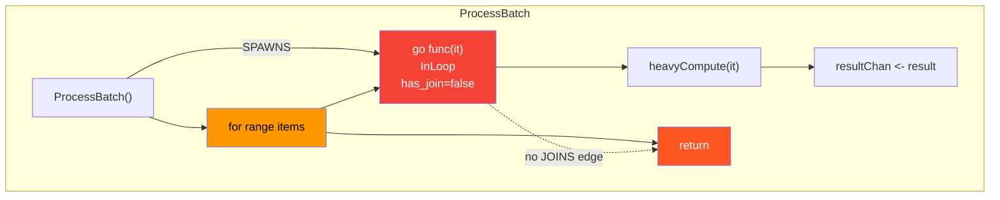
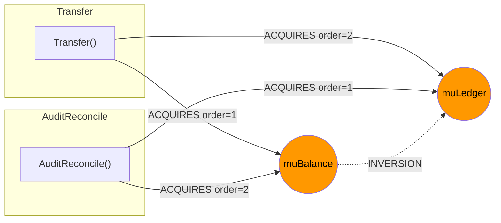
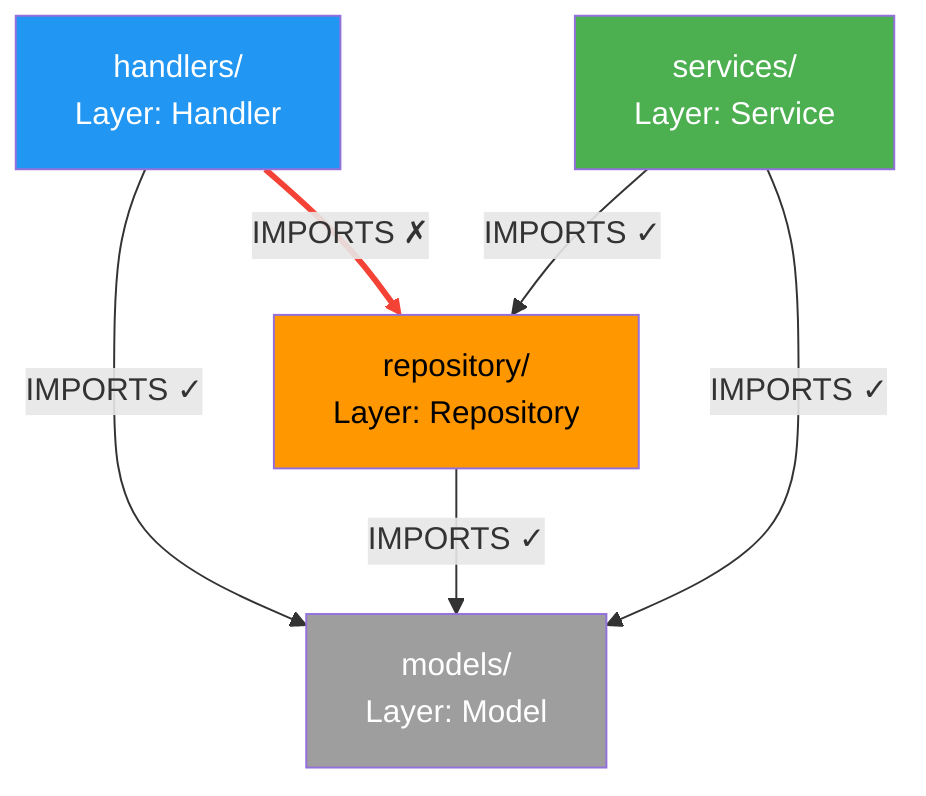
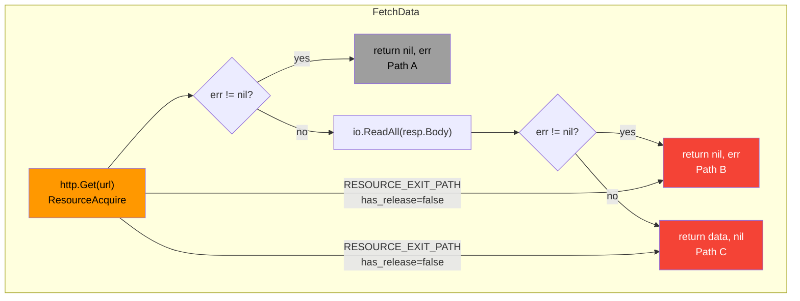

# Review: Customizable CodeFlow Analysis Rules

**Reviewer:** Claude
**Date:** 2026-03-09 (revised)
**Document Under Review:** `docs/CodeFlow/customizable-analysis-rules.md`
**Cross-references:** MVP plan, backend architecture, anti-pattern detection, data flow design

---

## Table of Contents

1. [Executive Summary](#1-executive-summary)
2. [The Three-Layer Model](#2-the-three-layer-model)
3. [Critique of the Rules Doc (Fact Generation)](#3-critique-of-the-rules-doc-fact-generation)
4. [Proposed: Graph Enrichment Layer](#4-proposed-graph-enrichment-layer)
5. [Analysis Query Layer Critique](#5-analysis-query-layer-critique)
6. [Tree-sitter Feasibility](#6-tree-sitter-feasibility)
7. [Configuration Syntax Alternatives](#7-configuration-syntax-alternatives)
8. [Worked Examples](#8-worked-examples)
9. [Recommendations](#9-recommendations)

---

## 1. Executive Summary

The customizable analysis rules doc gets the core philosophy right: the static analyzer is a generic engine that emits tagged nodes and typed edges, and analysis is an emergent property of querying that graph. The rules layer should generate facts about code — not perform analysis.

However, the doc has gaps in its fact-generation capabilities, and the system as a whole is missing a critical middle layer between "AST → graph facts" and "graph query → findings." This review identifies:

- **Fact generation gaps**: The rules doc can't express decorators, scope/lifetime edges, error-path flow, or structural context — facts the graph needs but currently can't get
- **A missing enrichment layer**: A generic graph-to-graph transformation system that derives higher-level facts (transaction scopes, lock propagation, resource lifetimes) before analysis queries run
- **The analysis layer is correctly designed** in the anti-pattern doc (Cypher queries over the graph) but needs better integration with the fact and enrichment layers
- **The signature syntax is too OOP-centric** for a language-agnostic system
- **YAML is adequate for simple rules** but alternatives should be considered for the full system

---

## 2. The Three-Layer Model

The CodeFlow system needs three distinct layers, each with different responsibilities and different configuration formats:

```
┌─────────────────────────────────────────────────────────┐
│  Layer 3: Analysis Queries                               │
│  "Find bugs by querying the graph"                       │
│  Input: populated graph   Output: findings               │
│  Format: Cypher/graph queries (already in anti-pattern   │
│          doc)                                             │
└────────────────────────┬────────────────────────────────┘
                         │ reads
┌────────────────────────▼────────────────────────────────┐
│  Layer 2: Graph Enrichment (NEW — proposed)              │
│  "Derive higher-level facts from the base graph"         │
│  Input: base graph   Output: new nodes/edges in graph    │
│  Format: graph-match → graph-write rules                 │
└────────────────────────┬────────────────────────────────┘
                         │ reads + writes
┌────────────────────────▼────────────────────────────────┐
│  Layer 1: Fact Generation Rules                          │
│  "Turn AST matches into graph nodes/edges/tags"          │
│  Input: source code (AST)   Output: base graph           │
│  Format: customizable-analysis-rules.md (this doc)       │
└─────────────────────────────────────────────────────────┘
```

### Why Three Layers?

Consider the transaction leak pattern. A user writes:

```go
// file: repo/users.go
func CreateUser(db *sql.DB, user User) error {
    tx, err := db.Begin()
    if err != nil { return err }

    err = insertUser(tx, user)
    if err != nil {
        return err  // BUG: tx is not rolled back
    }

    return tx.Commit()
}

// file: repo/helpers.go
func insertUser(tx *sql.Tx, user User) error {
    _, err := tx.Exec("INSERT INTO users ...", user.Name)
    return err
}
```

**Layer 1** (fact generation) can only work within a single AST — it sees `db.Begin()` and tags it as `TransactionStart`, sees `tx.Commit()` and tags it as `TransactionCommit`, sees `tx.Exec()` and emits `CALLS` edges. It **cannot** determine whether every control flow path from Begin reaches Commit or Rollback — that requires traversing the graph across functions.

**Layer 2** (enrichment) operates on the graph. It finds all `TransactionStart`-tagged nodes, walks `CALLS` and `NEXT` (control flow) edges, and creates a `TRANSACTION_SCOPE` node linking the start to all reachable commit/rollback/return points. This is a generic graph transformation — pattern match, then write new nodes/edges.

**Layer 3** (analysis) queries the enriched graph: "Find any `TRANSACTION_SCOPE` where at least one `CONTROL_FLOW_EXIT` path has no `TransactionCommit` or `TransactionRollback` node." This is a pure read query that emits a finding.

The rules doc only covers Layer 1. The anti-pattern doc covers Layer 3. Layer 2 doesn't exist yet.

---

## 3. Critique of the Rules Doc (Fact Generation)

The rules doc's job is narrow: match AST patterns, emit graph facts. Evaluated against that scope:

### 3.1 What the Doc Gets Right

- **Core philosophy is correct**: Generic engine, no hardcoded framework knowledge
- **Signature matching syntax** is reasonable for method-call patterns
- **`identity_expansion`** is clever — distinguishing `Getenv("PORT")` from `Getenv("SECRET")` as separate graph nodes is exactly the kind of fact-level decision that belongs here
- **Edge emission** (`SPAWNS`, `VALIDATES`, `HANDLES_ROUTE`) is the right abstraction
- **`terminates_execution`** is a good example of a control-flow fact
- **Type wrapper unwrapping** (`track_field: "String"`) — correct layer for this
- **Visual config** is correctly separated from analysis logic

### 3.2 The Signature Syntax Is Too OOP-Centric

The `Package::Receiver.Method(Args) -> Returns` format assumes method dispatch. This doesn't naturally express:

| Pattern | Problem |
|---|---|
| Free functions: `createServer(opts)` | No receiver, no package namespace in some languages |
| Python decorators: `@app.route("/path")` | Not a call — an annotation on a function definition |
| Chained calls: `app.use(cors()).use(auth())` | Multi-step chain, not a single call |
| Destructured returns: `const { data, error } = await fetch()` | Not `(val, error)` tuple |
| Rust macros: `tokio::spawn!(async { ... })` | Macro, not function call |
| Go `defer`/`go` keywords: `go func() {}()` | Language keyword, not method call |
| Property access: `process.env.SECRET` | Not a method call at all |
| Tagged templates: `` sql`SELECT * FROM ${table}` `` | Template literal, not function call |

**Proposal: Generalize "Target" instead of "Receiver"**

Replace `Receiver.Method` with a more flexible target syntax:

```
[Package]::[Target]([Arguments]) -> [Returns]

Where Target can be:
  - Receiver.Method        (Go/Java/TS method call)
  - Module.function        (Python/JS module function)
  - function               (free function)
  - @decorator             (decorator/annotation)
  - keyword expression     (go, defer, await, yield)
```

Or better yet, separate the "what kind of AST node am I matching?" from the signature:

```yaml
rules:
  - id: "python_route"
    match:
      kind: "decorator"                      # AST node type
      signature: "flask::*.route($path)"     # What's being decorated
      decorated: "$handler: Function"        # The decorated function
    node:
      on: "$handler"
      tags: ["APIHandler"]
      properties:
        path: "$path"

  - id: "go_spawn"
    match:
      kind: "go_statement"                   # Language keyword
      operand: "$fn: CallExpression"
    edge:
      type: "SPAWNS"
      from: "enclosing_function"
      to: "$fn"

  - id: "property_read"
    match:
      kind: "member_expression"
      object: "process.env"
      property: "$key: Identifier"
    node:
      identity_expansion: "$key"
      tags: ["Source", "Environment"]
```

### 3.3 Missing Fact Types

The rules doc can emit tags and edges. It's missing several categories of facts that downstream layers need:

#### Scope/Lifetime Facts

Language constructs like `defer`, `with`, `try-finally`, `using`, and RAII destructors create cleanup-on-exit semantics. These should be emitted as graph facts so the enrichment layer can reason about resource lifetimes.

```yaml
rules:
  - id: "go_defer"
    match:
      kind: "defer_statement"
      call: "$fn: CallExpression"
    edge:
      type: "DEFERRED_CLEANUP"
      from: "enclosing_function"
      to: "$fn"
      properties:
        trigger: "function_exit"    # When does cleanup run?
        scope: "enclosing_function" # What scope is it tied to?

  - id: "python_context_manager"
    match:
      kind: "with_statement"
      context_expr: "$resource"
      body: "$block"
    edge:
      type: "SCOPED_RESOURCE"
      from: "$resource"
      to: "$block"
      properties:
        has_cleanup: true
```

#### Error Flow Facts

Go's `(value, error)` return pattern, try/catch, Result types — these create implicit control flow branches. The graph should capture them:

```yaml
rules:
  - id: "go_error_return"
    match:
      kind: "if_statement"
      condition:
        kind: "binary_expression"
        operator: "!="
        operands: ["$err: Identifier", "nil"]
      consequence:
        contains:
          kind: "return_statement"
    edge:
      type: "ERROR_PATH"
      from: "$err"
      to: "return_statement"
      properties:
        error_var: "$err"
```

#### Structural Context Facts

The `spawn_in_loop` rule in the MVP plan needs to know a `go` statement is inside a `for` loop. This is an AST-level fact about nesting context — it belongs in Layer 1:

```yaml
rules:
  - id: "statement_in_loop"
    match:
      kind: ["go_statement", "call_expression"]
      ancestor:                          # AST ancestry check
        kind: ["for_statement", "range_over_clause"]
    node:
      tags: ["InLoop"]
      properties:
        loop_depth: "ancestor_count"     # How deeply nested?
```

#### Data Flow Semantic Annotations

The `track_field` for type unwrapping is good but the doc needs more data-flow-relevant fact types:

```yaml
rules:
  # "This function sanitizes its input for category X"
  - id: "html_sanitizer"
    match:
      signature: "html::*.EscapeString($input) -> $output"
    data_flow:
      role: "sanitizer"
      categories: ["XSS"]
      from: "$input"
      to: "$output"

  # "This function propagates taint from args to return"
  - id: "sprintf_propagates"
    match:
      signature: "fmt::*.Sprintf($fmt, ...$args) -> $result"
    data_flow:
      role: "propagator"
      from: "$args"
      to: "$result"

  # "This function is a taint source"
  - id: "env_source"
    match:
      signature: "os::*.Getenv($key) -> $val"
    data_flow:
      role: "source"
      category: "environment"
      value: "$val"
```

These annotations are facts about function semantics — not analysis themselves. They tell the enrichment layer how to propagate taint through the call graph.

### 3.4 Missing: Package/Module-Level Matching

The doc only matches at the call-site/type level. It should also support package-level facts:

```yaml
rules:
  - id: "handler_layer"
    match:
      package: "myapp/handlers/**"
    node:
      tags: ["Layer:Handler"]

  - id: "internal_package"
    match:
      package: "**/internal/**"
    node:
      tags: ["Visibility:Internal"]
```

These are simple tag rules on Package nodes — the analysis layer can then query for forbidden IMPORTS edges between layers.

### 3.5 Missing: Confidence on Generated Facts

The backend architecture doc mentions confidence metadata (`certain`, `probable`, `possible`) on edges, and `codeflow.semantic.yaml` mappings carry confidence. But the rules doc has no mechanism to express this:

```yaml
rules:
  - id: "probable_spawn"
    match:
      signature: "myapp/pool::*.Submit($fn)"
    edge:
      type: "SPAWNS"
      from: "self"
      to: "$fn"
      confidence: "probable"     # Not certain — depends on pool config
```

### 3.6 Missing: Rule Versioning

The MVP plan tracks `rule_version` on findings for incremental invalidation, but the rules doc doesn't define how rule version is determined. Simple approach: hash the rule definition itself.

---

## 4. Proposed: Graph Enrichment Layer

This is the key missing piece. Between fact generation (Layer 1) and analysis queries (Layer 3), we need a generic mechanism to derive higher-level graph facts from the base graph.

### 4.1 What This Layer Does

Enrichment rules match patterns in the existing graph and write new nodes/edges. They are:

- **Generic**: Just "match graph shape → write graph facts." Not specialized to any particular analysis.
- **Ordered**: Can depend on other enrichment rules' output (run in declared phases).
- **Incremental**: Only re-run when their input subgraph changes.
- **Separate from analysis**: They don't emit findings — they enrich the graph so analysis queries can be simpler and more powerful.

### 4.2 Why Not Just Do This in Analysis Queries?

You *could* fold enrichment into analysis queries — write one giant Cypher query that both derives facts and finds bugs. But:

1. **Reuse**: Multiple analysis queries need the same derived facts. If three different anti-patterns all need "transaction scope" information, computing it once in enrichment and querying it three times in analysis is cleaner.
2. **Composability**: Enrichment rules can build on each other. "Propagate lock holds through call graph" enables both "lock order inversion" and "unguarded write" patterns without either duplicating the propagation logic.
3. **Performance**: Pre-computing derived facts is more efficient than re-deriving them in every query.
4. **Debuggability**: You can inspect the enriched graph to verify that facts are correct before analysis queries run.

### 4.3 Enrichment Rule Format

Enrichment rules are graph-match → graph-write operations. They naturally use a Cypher-like syntax since they operate on the graph, not the AST:

```yaml
enrichment:
  - id: "transaction_scope"
    description: "Link transaction starts to all reachable commit/rollback/exit points"
    phase: 1
    match: |
      MATCH (start:CallSite)-[:TAG]->(t {name: "TransactionStart"})
      MATCH (fn:Function)-[:CONTAINS]->(start)
      MATCH path = (start)-[:NEXT|CALLS*]->(exit)
      WHERE exit:ReturnStatement
         OR exit.tags CONTAINS "TransactionCommit"
         OR exit.tags CONTAINS "TransactionRollback"
    write: |
      CREATE (scope:TransactionScope {
        start: start.id,
        function: fn.id
      })
      CREATE (scope)-[:STARTS_AT]->(start)
      CREATE (scope)-[:EXITS_VIA]->(exit)
      SET scope.exit_type = CASE
        WHEN exit.tags CONTAINS "TransactionCommit" THEN "commit"
        WHEN exit.tags CONTAINS "TransactionRollback" THEN "rollback"
        ELSE "unhandled_exit"
      END

  - id: "lock_hold_propagation"
    description: "Propagate HOLDS_LOCK through call graph until RELEASES"
    phase: 1
    match: |
      MATCH (fn:Function)-[acq:ACQUIRES]->(lock:SyncPrimitive)
      MATCH path = (fn)-[:CALLS*]->(callee:Function)
      WHERE NOT EXISTS {
        (fn)-[:CALLS*]->(releaser:Function)-[:RELEASES]->(lock)
        WHERE releaser IN nodes(path)
      }
    write: |
      CREATE (callee)-[:HOLDS_LOCK {
        acquired_by: fn.id,
        lock: lock.id,
        depth: length(path)
      }]->(lock)

  - id: "taint_propagation"
    description: "Propagate taint through calls to propagator functions"
    phase: 2   # Runs after phase 1
    match: |
      MATCH (src:Value {tainted: true})-[:FLOWS_TO]->(arg:Argument)
      MATCH (arg)-[:ARGUMENT_OF]->(call:CallSite)
      MATCH (call)-[:CALLS]->(fn:Function {data_flow_role: "propagator"})
      MATCH (fn)-[:RETURNS]->(ret:Value)
    write: |
      SET ret.tainted = true
      SET ret.taint_source = src.taint_source
      CREATE (src)-[:FLOWS_TO {through: fn.id, confidence: fn.confidence}]->(ret)

  - id: "resource_lifetime"
    description: "Track resource acquisition to all exit paths"
    phase: 1
    match: |
      MATCH (acq:CallSite)-[:TAG]->(t {name: "ResourceAcquire"})
      MATCH (fn:Function)-[:CONTAINS]->(acq)
      MATCH path = (acq)-[:NEXT*]->(exit:ReturnStatement)
    write: |
      CREATE (acq)-[:RESOURCE_PATH {
        has_release: EXISTS {
          (node)-[:TAG]->(rel {name: "ResourceRelease"})
          WHERE node IN nodes(path)
          AND rel.resource_type = t.resource_type
        },
        path_length: length(path)
      }]->(exit)
```

### 4.4 Key Design Principles

1. **No findings in enrichment.** Enrichment only writes graph facts. If you're tempted to emit a finding here, it belongs in Layer 3.

2. **Phases for ordering.** Enrichment rules declare a phase number. Rules in phase N can read facts written by phases 1..N-1. This handles dependencies like "propagate taint" depending on "resolve call targets."

3. **Idempotent writes.** Running an enrichment rule twice should not duplicate nodes/edges. Use MERGE semantics or epoch-based cleanup.

4. **Same incremental model as Layer 1.** Enrichment facts carry `scan_epoch` and `producer` metadata. When input facts change, dependent enrichment facts are invalidated and recomputed.

5. **Enrichment rules are project-configurable.** Teams can add their own enrichment rules for framework-specific patterns. E.g., a team using a custom ORM could write enrichment that creates `TRANSACTION_SCOPE` nodes from their ORM's transaction API, without changing any analysis queries.

### 4.5 What Enrichment Is NOT

- Not a general-purpose graph computation framework. It's pattern-match → write-facts, not arbitrary algorithms.
- Not analysis. It shouldn't make judgments about correctness.
- Not a replacement for the core pipeline (CFG/DFG builders). Those are baked-in analysis stages. Enrichment is for project-customizable derived facts.

---

## 5. Analysis Query Layer Critique

The anti-pattern detection doc (06) gets this right: analysis is Cypher queries over the graph. With the enrichment layer in place, analysis queries become much simpler.

### 5.1 What the Anti-Pattern Doc Gets Right

- Graph predicates as the analysis primitive
- Reusable predicate fragments (`isExecutionUnit`, `acquires`, `reachableFrom`)
- Severity + explain template system
- Findings lifecycle (open → acknowledged → fixed/suppressed)
- User-defined patterns via `.codeflow/patterns/`

### 5.2 What's Missing: Negative Path Queries

The most important analysis patterns are about *missing* paths. Cypher handles this with `NOT EXISTS`:

```cypher
// Transaction leak: TransactionScope with an unhandled exit
MATCH (scope:TransactionScope)-[:EXITS_VIA]->(exit)
WHERE scope.exit_type = "unhandled_exit"
RETURN scope, exit
```

```cypher
// Resource leak: resource acquired, no release on some path
MATCH (acq:CallSite)-[rp:RESOURCE_PATH]->(exit:ReturnStatement)
WHERE rp.has_release = false
RETURN acq, exit
```

```cypher
// Goroutine leak: spawn with no reachable join
MATCH (fn:Function)-[:SPAWNS]->(eu:ExecutionUnit)
WHERE NOT EXISTS {
  (eu)-[:JOINED_BY]->(:CallSite)
}
AND NOT EXISTS {
  (eu)-[:CANCELLED_BY]->(:CallSite)
}
RETURN fn, eu
```

These queries are clean because the enrichment layer pre-computed the relevant scope/path facts. Without enrichment, these queries would need to embed the full path traversal logic, making them complex and expensive.

### 5.3 Analysis Should Remain Pure Reads

Analysis queries should never write to the graph (except for `Finding` nodes). This keeps them safe, idempotent, and parallelizable. The mutation responsibility belongs to Layer 1 (facts) and Layer 2 (enrichment).

### 5.4 Parameterized Analysis Templates

The anti-pattern doc shows hardcoded query patterns. Consider parameterized templates for common analysis shapes:

```yaml
# Analysis template: "acquired resource with missing cleanup on some path"
analysis_templates:
  - id: "resource_leak_template"
    parameters:
      acquire_tag: string       # e.g., "TransactionStart", "ResourceAcquire"
      release_tag: string       # e.g., "TransactionCommit", "ResourceRelease"
    query: |
      MATCH (acq:CallSite)-[:TAG]->(t {name: $acquire_tag})
      MATCH (acq)-[rp:RESOURCE_PATH]->(exit)
      WHERE rp.has_release = false
      RETURN acq, exit

# Instantiated for transactions
analyses:
  - id: "transaction_leak"
    template: "resource_leak_template"
    params:
      acquire_tag: "TransactionStart"
      release_tag: "TransactionCommit"
    severity: "critical"

  - id: "http_body_leak"
    template: "resource_leak_template"
    params:
      acquire_tag: "HTTPResponseAcquire"
      release_tag: "HTTPResponseClose"
    severity: "high"

  - id: "file_handle_leak"
    template: "resource_leak_template"
    params:
      acquire_tag: "FileOpen"
      release_tag: "FileClose"
    severity: "high"
```

Same analysis logic, different facts. This is where genericity pays off — the rules doc defines what constitutes "acquire" and "release" for each resource type, enrichment creates the scope/path facts, and a single query template finds all resource leaks.

---

## 6. Tree-sitter Feasibility

### 6.1 Tree-sitter's Role: Layer 1 Only

Tree-sitter is the parsing frontend for fact generation. It:

- Parses source files into concrete syntax trees
- Supports incremental re-parsing (only re-parse changed regions)
- Has a query language (S-expressions) for structural matching
- Works per-file — no cross-file knowledge

This maps perfectly to Layer 1's job. Tree-sitter queries can express:

```scheme
;; Match go statement inside for loop
(for_statement
  body: (block
    (go_statement) @spawn))

;; Match defer statement calling a method named "Close"
(defer_statement
  (call_expression
    function: (selector_expression
      field: (field_identifier) @method)
    (#eq? @method "Close")) @deferred_close)

;; Match if err != nil { return ... } pattern
(if_statement
  condition: (binary_expression
    left: (identifier) @err
    operator: "!="
    right: (nil))
  (#eq? @err "err")
  consequence: (block
    (return_statement) @error_return))
```

### 6.2 What Tree-sitter Cannot Do (and Shouldn't Try)

Tree-sitter operates on syntax, not semantics. It cannot:

| Capability | Why Not |
|---|---|
| **Resolve types** | `mu.Lock()` — tree-sitter sees `mu` as an identifier, doesn't know it's a `sync.Mutex` |
| **Resolve imports** | Can see `import "database/sql"` but can't resolve which `Query` call goes to which package |
| **Cross-file analysis** | Parses one file at a time |
| **Control flow reachability** | Sees all branches syntactically but can't determine which are dead code |
| **Data flow** | Sees assignments but can't track values through function boundaries |

These all belong to the semantic resolution stage (between tree-sitter parsing and graph population) or to the graph itself.

### 6.3 The Signature Syntax Sits on Top of Tree-sitter

The proposed `Package::Receiver.Method(Args)` syntax requires symbol resolution that tree-sitter can't provide. The pipeline is:

```
Source File
    │
    ▼ (tree-sitter)
Concrete Syntax Tree
    │
    ▼ (symbol resolver — uses import analysis, type inference)
Resolved AST (with type/package annotations)
    │
    ▼ (signature matcher — the glob syntax from the rules doc)
Matched nodes
    │
    ▼ (fact emitter)
Graph nodes/edges/tags
```

Tree-sitter handles step 1. The signature matcher runs at step 3, after the resolver adds semantic information. Both are needed — tree-sitter for structural patterns (loop nesting, defer presence), signatures for semantic patterns (package-qualified calls).

### 6.4 Exposing Tree-sitter Queries in Rules

The rules doc should allow both matching modes:

```yaml
rules:
  # Structural match — tree-sitter query directly
  - id: "spawn_in_loop"
    match:
      tree_sitter: |
        (for_statement
          body: (block (go_statement) @spawn))
    node:
      on: "@spawn"
      tags: ["InLoop"]

  # Semantic match — resolved signature
  - id: "sql_sink"
    match:
      signature: "database/sql::*DB.Exec($q, ...$args)"
    node:
      tags: ["Sink", "SQL"]

  # Combined — structural context + semantic match
  - id: "transaction_in_loop"
    match:
      signature: "database/sql::*DB.Begin()"
      context:
        ancestor: "for_statement"   # Tree-sitter node type
    node:
      tags: ["TransactionStart", "InLoop"]
```

This is feasible because both matching modes operate in Layer 1 — they just use different inputs (raw AST vs resolved AST).

---

## 7. Configuration Syntax Alternatives

### 7.1 What Needs Configuration?

Each layer has different configuration needs:

| Layer | Content | Complexity | Volume |
|---|---|---|---|
| **L1: Fact generation** | AST match → tag/edge | Simple per rule, many rules | High (50-200 rules per project) |
| **L2: Enrichment** | Graph match → graph write | Medium (Cypher-like queries) | Low (5-20 rules) |
| **L3: Analysis** | Graph query → finding | Complex graph queries | Low-medium (10-30 patterns) |

### 7.2 YAML — Current Choice

**Works well for**: Layer 1 simple rules (tag this call, add this edge).

**Breaks down for**: Embedded tree-sitter queries (string escaping), enrichment rules (Cypher in YAML strings), any rule with conditional logic.

```yaml
# Simple rule — YAML is fine
rules:
  - id: "mark_sql_sinks"
    match:
      signature: "database/sql::*DB.Exec(*)"
    node:
      tags: ["Sink", "SQL"]

# Complex rule — YAML is painful
rules:
  - id: "express_route"
    match:
      signature: "express::*Router.$method(Literal('get'|'post'|'put'|'delete'), $path: StringLiteral, $handler: Function)"
    emit:
      node:
        label: "APIHandler"
        properties:
          method: "$method"
          path: "$path"
      edge:
        type: "HANDLES_ROUTE"
        from: "APIHandler"
        to: "$handler"
```

The second rule is already pushing YAML's readability. Adding tree-sitter queries or Cypher inside YAML strings makes it worse.

### 7.3 Starlark

Sandboxed Python-like language. Used by Bazel/Buck2.

```python
# Layer 1: Fact generation
rule(
    id = "sql_sink",
    match = signature("database/sql::*DB.Exec($q, ...$args)"),
    tags = ["Sink", "SQL"],
)

# Composable — define reusable groups
HTTP_SOURCES = [
    signature("net/http::*Request.URL.Query().Get($key)"),
    signature("net/http::*Request.Form.Get($key)"),
    signature("net/http::*Request.Body"),
]

for sig in HTTP_SOURCES:
    rule(
        id = "http_source_" + sig.method_name(),
        match = sig,
        tags = ["Source", "HTTP"],
    )

# Layer 2: Enrichment (Cypher embedded naturally)
enrichment(
    id = "transaction_scope",
    phase = 1,
    match = """
        MATCH (start:CallSite)-[:TAG]->(t {name: "TransactionStart"})
        MATCH (fn:Function)-[:CONTAINS]->(start)
        MATCH path = (start)-[:NEXT|CALLS*]->(exit)
        WHERE exit:ReturnStatement
           OR exit.tags CONTAINS "TransactionCommit"
           OR exit.tags CONTAINS "TransactionRollback"
    """,
    write = """
        CREATE (scope:TransactionScope {start: start.id, function: fn.id})
        CREATE (scope)-[:STARTS_AT]->(start)
        CREATE (scope)-[:EXITS_VIA {type: ...}]->(exit)
    """,
)
```

**Pros**: Composability (variables, loops), multi-line strings, sandboxed execution, Go implementation exists.
**Cons**: Slightly higher learning curve, harder to generate programmatically.

### 7.4 HCL

HashiCorp Configuration Language. Block-structured, heredoc support.

```hcl
rule "sql_sink" {
  match {
    signature = "database/sql::*DB.Exec($q, ...$args)"
  }
  node {
    tags = ["Sink", "SQL"]
  }
}

enrichment "transaction_scope" {
  phase = 1
  match = <<-CYPHER
    MATCH (start:CallSite)-[:TAG]->(t {name: "TransactionStart"})
    MATCH (fn:Function)-[:CONTAINS]->(start)
    ...
  CYPHER
  write = <<-CYPHER
    CREATE (scope:TransactionScope {...})
    ...
  CYPHER
}
```

**Pros**: Heredoc strings solve embedded-query readability, block structure natural for rules, Go-native parser.
**Cons**: Less composable than Starlark, no looping/variables.

### 7.5 Custom DSL

```
@version("1")

// Layer 1 — concise fact rules
tag Sink.SQL     on database/sql::*DB.Exec(*)
tag Sink.SQL     on database/sql::*DB.Query(*)
tag Source.HTTP   on net/http::*Request.URL.Query().Get($key)  expand $key

edge SPAWNS self -> $fn
  on myapp/pool::*Worker.Submit($fn: Function)

// Layer 2 — enrichment as named graph transforms
enrich transaction_scope(phase=1) {
  match  { (start {tag: TransactionStart})-[:NEXT|CALLS*]->(exit) }
  write  { (scope:TransactionScope)-[:STARTS_AT]->(start),
            (scope)-[:EXITS_VIA]->(exit) }
}

// Layer 3 — analysis as named queries
find transaction_leak(severity=critical) {
  match  { (scope:TransactionScope)-[:EXITS_VIA {type: "unhandled_exit"}]->(exit) }
  explain "Transaction started at {{scope.start}} exits without commit/rollback at {{exit}}"
}
```

**Pros**: Maximum conciseness, domain-optimized. The `tag X on Y` syntax is immediately readable.
**Cons**: Requires building a parser, no ecosystem tooling.

### 7.6 Recommendation

| Layer | Recommended Format | Rationale |
|---|---|---|
| L1 (facts) | **YAML for simple rules** — the current format works | Most rules are one-match-one-tag; YAML is fine |
| L1 (complex) | **Starlark for rule libraries** | When projects need loops, composition, or many similar rules |
| L2 (enrichment) | **Cypher-in-YAML** or **Cypher-in-HCL** | Enrichment rules are inherently Cypher; the container format matters less |
| L3 (analysis) | **Cypher with templates** | Already proposed in anti-pattern doc; add parameterized templates |

The custom DSL is tempting for its conciseness but only worth the investment if the team commits to building an LSP, syntax highlighting, and documentation. For an MVP, YAML + Cypher strings is pragmatic.

---

## 8. Worked Examples

Each example shows all three layers working together: fact-generation rules, enrichment (where applicable), analysis query, the resulting graph, and the finding.

### Example 1: Transaction Leak

**Source Code:**

```go
// repo/orders.go
func CreateOrder(db *sql.DB, order Order) error {
    tx, err := db.Begin()                    // ← Transaction starts
    if err != nil { return err }

    _, err = tx.Exec("INSERT INTO orders ...", order.ID)
    if err != nil {
        return fmt.Errorf("insert: %w", err) // ← BUG: no rollback
    }

    _, err = tx.Exec("INSERT INTO items ...", order.Items)
    if err != nil {
        tx.Rollback()                        // ← Rollback (correct)
        return fmt.Errorf("items: %w", err)
    }

    return tx.Commit()                       // ← Commit (correct)
}
```

**Layer 1 — Fact Generation Rules:**

```yaml
rules:
  - id: "tx_begin"
    match:
      signature: "database/sql::*DB.Begin() -> ($tx, error)"
    node:
      tags: ["TransactionStart"]
      properties:
        resource_type: "sql_transaction"

  - id: "tx_commit"
    match:
      signature: "database/sql::*Tx.Commit() -> error"
    node:
      tags: ["TransactionCommit"]

  - id: "tx_rollback"
    match:
      signature: "database/sql::*Tx.Rollback() -> error"
    node:
      tags: ["TransactionRollback"]
```

These rules only tag call sites. They don't reason about paths.

**Layer 2 — Enrichment Rule:**

```yaml
enrichment:
  - id: "transaction_scope"
    phase: 1
    match: |
      MATCH (start:CallSite {tags: "TransactionStart"})
      MATCH (fn:Function)-[:CONTAINS]->(start)
      MATCH path = (start)-[:NEXT*]->(exit)
      WHERE exit:ReturnStatement
         OR "TransactionCommit" IN exit.tags
         OR "TransactionRollback" IN exit.tags
    write: |
      MERGE (scope:TransactionScope {id: start.id + "/scope"})
      SET scope.function = fn.id
      MERGE (scope)-[:TX_STARTS_AT]->(start)
      MERGE (scope)-[:TX_EXITS_VIA {
        exit_type: CASE
          WHEN "TransactionCommit" IN exit.tags THEN "commit"
          WHEN "TransactionRollback" IN exit.tags THEN "rollback"
          ELSE "unhandled"
        END
      }]->(exit)
```

This creates a `TransactionScope` node linked to all exit paths, classified by type.

**Layer 3 — Analysis Query:**

```yaml
analyses:
  - id: "transaction_leak"
    severity: "critical"
    query: |
      MATCH (scope:TransactionScope)-[ev:TX_EXITS_VIA]->(exit)
      WHERE ev.exit_type = "unhandled"
      MATCH (scope)-[:TX_STARTS_AT]->(start)
      RETURN scope, start, exit
    explain: |
      Transaction started at {{start.file}}:{{start.line}} has a control flow
      path to {{exit.file}}:{{exit.line}} with no Commit() or Rollback().
```

**Resulting Graph:**



**Findings:**

```
CRITICAL: transaction_leak
  Transaction: repo/orders.go:3 — db.Begin()
  Unhandled exit paths:
    1. repo/orders.go:4 — error return (err from Begin)
       Note: This path returns before any transaction work; may be intentionally
       unhandled since Begin itself failed. Consider lowering to "medium" if
       the error means the transaction was never opened.
    2. repo/orders.go:8 — error return (err from first Exec)
       No Rollback() on this path. Transaction will remain open until
       connection timeout or GC.
  Handled exits:
    - repo/orders.go:14 — Rollback (correct)
    - repo/orders.go:17 — Commit (correct)
```

Note: A smarter enrichment rule could recognize that `RET1` happens on the error path of `Begin()` itself — meaning the transaction was never successfully opened. This is where confidence levels help: that exit path might be tagged `confidence: "possible"` vs the second path being `confidence: "certain"`.

---

### Example 2: SQL Injection (Taint Flow)

**Source Code:**

```go
func SearchHandler(w http.ResponseWriter, r *http.Request) {
    query := r.URL.Query().Get("q")           // SOURCE
    filter := r.URL.Query().Get("filter")      // SOURCE

    sanitizedFilter := sanitize(filter)         // SANITIZER

    rows, _ := db.Query(
        fmt.Sprintf("SELECT * FROM items WHERE name = '%s' AND cat = '%s'",
            query, sanitizedFilter))            // SINK

    writeResponse(w, rows)
}
```

**Layer 1 — Fact Generation:**

```yaml
rules:
  - id: "http_query_source"
    match:
      signature: "net/http::*Request.URL.Query().Get($key: StringLiteral)"
    node:
      identity_expansion: "$key"
      tags: ["Source", "UserInput"]
    data_flow:
      role: "source"
      category: "http_query"
      value: "return"

  - id: "sql_query_sink"
    match:
      signature: "database/sql::*DB.Query($q, ...$args)"
    node:
      tags: ["Sink", "SQL"]
    data_flow:
      sink_params: ["$q"]

  - id: "sanitize_function"
    match:
      signature: "handlers::*.sanitize($input) -> $output"
    data_flow:
      role: "sanitizer"
      categories: ["SQL"]
      from: "$input"
      to: "$output"

  - id: "sprintf_propagator"
    match:
      signature: "fmt::*.Sprintf($fmt, ...$args) -> $result"
    data_flow:
      role: "propagator"
      from: "$args"
      to: "$result"
```

**Layer 2 — Enrichment:**

```yaml
enrichment:
  - id: "taint_propagation"
    phase: 1
    description: "Follow FLOWS_TO edges, propagating taint through propagators and clearing through sanitizers"
    match: |
      MATCH (source:Value)-[:FLOWS_TO*]->(sink:Value)
      WHERE "Source" IN source.tags
      AND "Sink" IN sink.tags
    write: |
      CREATE (path:TaintPath {
        source: source.id,
        sink: sink.id
      })
      CREATE (path)-[:TAINT_SOURCE]->(source)
      CREATE (path)-[:TAINT_SINK]->(sink)
      SET path.sanitized = EXISTS {
        (sanitizer:CallSite {data_flow_role: "sanitizer"})
        WHERE sanitizer IN nodes(path)
        AND source.taint_category IN sanitizer.sanitizes
      }
```

**Layer 3 — Analysis:**

```yaml
analyses:
  - id: "unsanitized_taint"
    severity: "critical"
    query: |
      MATCH (tp:TaintPath)
      WHERE tp.sanitized = false
      MATCH (tp)-[:TAINT_SOURCE]->(source)
      MATCH (tp)-[:TAINT_SINK]->(sink)
      RETURN source, sink
    explain: |
      User input at {{source.file}}:{{source.line}} flows to
      {{sink.file}}:{{sink.line}} without sanitization.
```

**Resulting Graph:**



**Finding:**

```
CRITICAL: unsanitized_taint
  Source: handlers/search.go:2 — r.URL.Query().Get("q") [HTTP query param]
  Sink: handlers/search.go:7 — db.Query(fmt.Sprintf(...)) [SQL execution]
  Path: Get("q") → fmt.Sprintf() → db.Query()
  Sanitizer: None on this path
  Note: "filter" parameter IS sanitized via sanitize() — only "q" is vulnerable
```

---

### Example 3: Goroutine Leak

**Source Code:**

```go
func ProcessBatch(items []Item) {
    for _, item := range items {
        go func(it Item) {
            result := heavyCompute(it)
            resultChan <- result
        }(item)
    }
    // No WaitGroup, no channel drain
}
```

**Layer 1 — Fact Generation:**

```yaml
rules:
  - id: "go_spawn"
    match:
      kind: "go_statement"
    edge:
      type: "SPAWNS"
      from: "enclosing_function"
      to: "operand"

  - id: "in_loop_context"
    match:
      kind: "go_statement"
      context:
        ancestor: ["for_statement", "range_over_clause"]
    node:
      tags: ["InLoop"]

  - id: "waitgroup_wait"
    match:
      signature: "sync::*WaitGroup.Wait()"
    node:
      tags: ["JoinPoint"]
    edge:
      type: "JOINS"
      from: "enclosing_function"
      to: "scope_execution_units"
```

No absence detection here — just facts: "this is a spawn," "it's in a loop," "this is a join point."

**Layer 2 — Enrichment:**

```yaml
enrichment:
  - id: "link_spawns_to_joins"
    phase: 1
    match: |
      MATCH (fn:Function)-[:SPAWNS]->(eu:ExecutionUnit)
      OPTIONAL MATCH (fn)-[:CONTAINS]->(:CallSite)-[:JOINS]->(eu)
      OPTIONAL MATCH (fn)-[:CONTAINS]->(:CallSite {tags: "JoinPoint"})
    write: |
      SET eu.has_join = (join IS NOT NULL)
      SET eu.has_any_join_in_scope = (joinPoint IS NOT NULL)
```

**Layer 3 — Analysis:**

```yaml
analyses:
  - id: "goroutine_leak"
    severity: "critical"
    query: |
      MATCH (fn:Function)-[:SPAWNS]->(eu:ExecutionUnit)
      WHERE eu.has_join = false
      RETURN fn, eu
    explain: "Goroutine spawned at {{eu.file}}:{{eu.line}} in {{fn.name}} has no reachable join point."

  - id: "unbounded_spawn"
    severity: "high"
    query: |
      MATCH (fn:Function)-[:SPAWNS]->(eu:ExecutionUnit)
      WHERE "InLoop" IN eu.tags
      AND eu.has_join = false
      RETURN fn, eu
    explain: "Goroutine spawned inside loop at {{eu.file}}:{{eu.line}} — unbounded concurrency with no join."
```

**Resulting Graph:**



**Finding:**

```
CRITICAL: goroutine_leak
  Spawn: workers/batch.go:3 — go func(it Item) inside ProcessBatch
  Join: none found

HIGH: unbounded_spawn
  Spawn: workers/batch.go:3 — inside for-range loop
  Goroutine count: O(len(items)) — unbounded
```

---

### Example 4: Lock Order Inversion

This example demonstrates that **not every pattern needs enrichment**. Sometimes Layer 1 facts are sufficient for Layer 3 queries directly.

**Source Code:**

```go
func Transfer(from, to *Account, amount int) {
    muBalance.Lock()         // order=1
    defer muBalance.Unlock()
    muLedger.Lock()          // order=2
    defer muLedger.Unlock()
    // ... transfer logic
}

func AuditReconcile() {
    muLedger.Lock()          // order=1 (INVERTED)
    defer muLedger.Unlock()
    muBalance.Lock()         // order=2 (INVERTED)
    defer muBalance.Unlock()
    // ... reconciliation
}
```

**Layer 1 — Fact Generation:**

```yaml
rules:
  - id: "mutex_lock"
    match:
      signature: "sync::*Mutex.Lock()"
      bind_receiver: "$mu"
    edge:
      type: "ACQUIRES"
      from: "enclosing_function"
      to: "$mu"
      properties:
        order: "auto_increment_per_function"
```

**Layer 2 — Not needed.** The ACQUIRES edges with order properties are sufficient.

**Layer 3 — Analysis (directly on Layer 1 facts):**

```yaml
analyses:
  - id: "lock_order_inversion"
    severity: "critical"
    query: |
      MATCH (f1:Function)-[a1:ACQUIRES]->(r1:SyncPrimitive),
            (f1)-[a2:ACQUIRES]->(r2:SyncPrimitive)
      WHERE a1.order < a2.order AND r1 <> r2
      MATCH (f2:Function)-[b1:ACQUIRES]->(r2),
            (f2)-[b2:ACQUIRES]->(r1)
      WHERE b1.order < b2.order AND f1 <> f2
      RETURN f1, f2, r1, r2
    explain: |
      {{f1.name}} acquires {{r1.name}}({{a1.order}}) then {{r2.name}}({{a2.order}}).
      {{f2.name}} acquires {{r2.name}}({{b1.order}}) then {{r1.name}}({{b2.order}}).
      Deadlock possible under concurrent execution.
```

**Resulting Graph:**



**Finding:**

```
CRITICAL: lock_order_inversion
  Transfer() acquires muBalance(1) then muLedger(2).
  AuditReconcile() acquires muLedger(1) then muBalance(2).
  Deadlock possible under concurrent execution.
```

This is a good example of the system's flexibility: simple patterns don't need the enrichment layer at all. The analysis query works directly on Layer 1 facts.

---

### Example 5: Architectural Layer Violation

Another example where enrichment isn't needed — Layer 1 tags packages, Layer 3 queries for forbidden edges.

**Source Code:**

```go
// handlers/user.go
package handlers

import (
    "myapp/models"        // OK
    "myapp/repository"    // VIOLATION: should go through services
)

func GetUser(w http.ResponseWriter, r *http.Request) {
    user, _ := repository.FindUserByID(r.URL.Query().Get("id"))
    writeJSON(w, user)
}
```

**Layer 1 — Fact Generation:**

```yaml
rules:
  - id: "layer_handler"
    match:
      package: "myapp/handlers/**"
    node:
      tags: ["Layer:Handler"]
      properties: { layer: "handler" }

  - id: "layer_service"
    match:
      package: "myapp/services/**"
    node:
      tags: ["Layer:Service"]
      properties: { layer: "service" }

  - id: "layer_repository"
    match:
      package: "myapp/repository/**"
    node:
      tags: ["Layer:Repository"]
      properties: { layer: "repository" }

  - id: "layer_model"
    match:
      package: "myapp/models/**"
    node:
      tags: ["Layer:Model"]
      properties: { layer: "model" }
```

**Layer 2 — Not needed.**

**Layer 3 — Analysis:**

```yaml
analyses:
  - id: "layer_violation"
    severity: "high"
    params:
      forbidden_edges:
        - { from: "handler", to: "repository" }
        - { from: "handler", to: "database" }
        - { from: "model", to: "handler" }
        - { from: "model", to: "service" }
        - { from: "repository", to: "handler" }
    query: |
      MATCH (src:Package)-[:IMPORTS]->(dst:Package)
      WHERE [src.layer, dst.layer] IN $forbidden_edges
      RETURN src, dst
    explain: |
      Package {{src.path}} ({{src.layer}} layer) imports
      {{dst.path}} ({{dst.layer}} layer).
      This violates the declared layer policy.
```

**Resulting Graph:**



---

### Example 6: HTTP Response Body Leak (Resource Lifetime)

This example shows the enrichment layer handling resource lifetimes — a generic pattern that applies to files, connections, transactions, and any other resource.

**Source Code:**

```go
func FetchData(url string) ([]byte, error) {
    resp, err := http.Get(url)
    if err != nil {
        return nil, err             // Path A: no resource (Begin failed)
    }
    // BUG: no defer resp.Body.Close()

    data, err := io.ReadAll(resp.Body)
    if err != nil {
        return nil, err             // Path B: resource leaks
    }
    return data, nil                // Path C: resource leaks
}
```

**Layer 1 — Fact Generation:**

```yaml
rules:
  - id: "http_get_resource"
    match:
      signature: "net/http::*.Get($url) -> ($resp, error)"
    node:
      tags: ["ResourceAcquire"]
      properties:
        resource_type: "http_response_body"
        resource_binding: "$resp.Body"

  - id: "body_close_release"
    match:
      signature: "*::*.Body.Close()"
    node:
      tags: ["ResourceRelease"]
      properties:
        resource_type: "http_response_body"

  - id: "defer_cleanup"
    match:
      kind: "defer_statement"
    edge:
      type: "DEFERRED_CLEANUP"
      from: "enclosing_function"
      to: "deferred_call"
```

**Layer 2 — Enrichment (generic resource lifetime):**

```yaml
enrichment:
  - id: "resource_lifetime"
    phase: 1
    description: "For each resource acquisition, trace all control flow exit paths and check for release"
    match: |
      MATCH (acq:CallSite {tags: "ResourceAcquire"})
      MATCH (fn:Function)-[:CONTAINS]->(acq)
      MATCH path = (acq)-[:NEXT*]->(exit:ReturnStatement)
    write: |
      MERGE (acq)-[:RESOURCE_EXIT_PATH {
        has_release: ANY(node IN nodes(path) WHERE
          "ResourceRelease" IN node.tags
          AND node.resource_type = acq.resource_type
        ),
        has_deferred_release: EXISTS {
          (fn)-[:DEFERRED_CLEANUP]->(rel:CallSite)
          WHERE "ResourceRelease" IN rel.tags
          AND rel.resource_type = acq.resource_type
        },
        exit_line: exit.line
      }]->(exit)
```

**Layer 3 — Analysis (generic, works for any resource):**

```yaml
analyses:
  - id: "resource_leak"
    severity: "high"
    query: |
      MATCH (acq:CallSite {tags: "ResourceAcquire"})-[rep:RESOURCE_EXIT_PATH]->(exit)
      WHERE rep.has_release = false AND rep.has_deferred_release = false
      RETURN acq, exit, acq.resource_type AS resource_type
    explain: |
      Resource {{resource_type}} acquired at {{acq.file}}:{{acq.line}}
      is not released on exit path at {{exit.file}}:{{exit.line}}.
```

**Resulting Graph:**



Note: Path A (RET_A) might not have a `RESOURCE_EXIT_PATH` edge at all if the enrichment rule is smart enough to recognize that the resource acquisition itself failed on that path (the error check is on the return value of `Get()`). This is a nuance the enrichment rule can handle with additional control flow analysis, or it can conservatively flag it and let the analysis query use confidence to filter.

**Finding:**

```
HIGH: resource_leak
  Resource: http_response_body acquired at client/fetch.go:2
  Leaking exit paths:
    - client/fetch.go:10 (error return from ReadAll)
    - client/fetch.go:12 (success return)
  Fix: Add `defer resp.Body.Close()` after the nil-error check
```

The same `resource_leak` analysis query would also catch file handle leaks, database connection leaks, or any other resource — as long as Layer 1 rules tag the acquire/release calls appropriately.

---

## 9. Recommendations

### For the Rules Doc (Layer 1)

| Priority | Change |
|---|---|
| **Must** | Generalize signature syntax beyond OOP (`kind` field, decorator support, keyword matching) |
| **Must** | Add `context` field for AST ancestor constraints (needed for `spawn_in_loop` in MVP) |
| **Must** | Add `data_flow` annotations (`role: source/sink/sanitizer/propagator`) as fact-level metadata |
| **Must** | Add `confidence` field on emitted edges |
| **Should** | Support tree-sitter queries directly (`match.tree_sitter`) alongside signature matching |
| **Should** | Add package-level matching (`match.package`) |
| **Should** | Add scope/lifetime fact emission (`DEFERRED_CLEANUP`, `SCOPED_RESOURCE` edges) |
| **Should** | Define rule versioning (hash-based, for incremental invalidation) |
| **Nice** | Add more non-Go examples (Python/TS/Rust) |

### For the System (New: Layer 2)

| Priority | Change |
|---|---|
| **Must** | Design and document the graph enrichment layer |
| **Must** | Define phase ordering for enrichment rules |
| **Must** | Ensure enrichment rules are project-configurable (not just built-in) |
| **Should** | Provide built-in enrichment for common patterns (resource lifetime, taint propagation, lock hold propagation) |
| **Should** | Define incremental invalidation for enrichment facts |

### For the Anti-Pattern Doc (Layer 3)

| Priority | Change |
|---|---|
| **Should** | Add parameterized analysis templates (resource leak template, path-without-waypoint template) |
| **Should** | Explicitly document the negative-path query patterns (`NOT EXISTS`, `WHERE ... = false`) |
| **Should** | Show how analysis queries compose with enrichment facts |

### On Config Format

- Keep **YAML** for Layer 1 (simple rules). It works.
- Use **Cypher-in-YAML** for Layer 2 (enrichment rules) and Layer 3 (analysis queries) — these are inherently graph operations.
- Consider **Starlark** if/when projects need to generate many similar rules programmatically, or a **custom DSL** if the team invests in tooling.
- Don't over-optimize the format before the functionality is proven — YAML + embedded Cypher is pragmatic for MVP.
