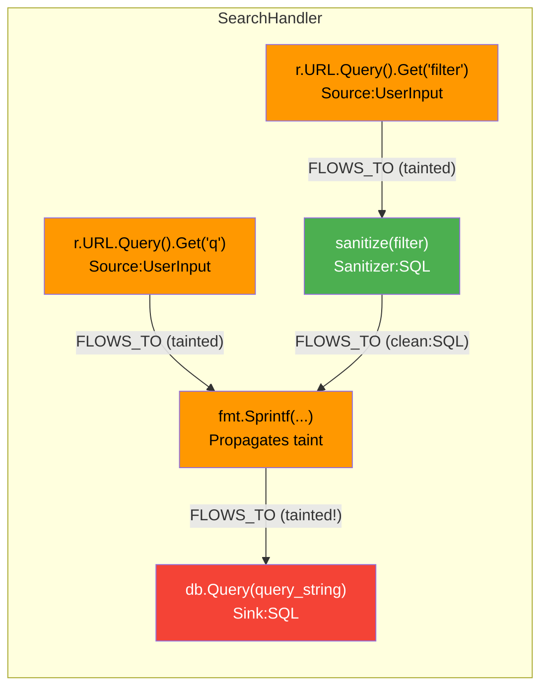
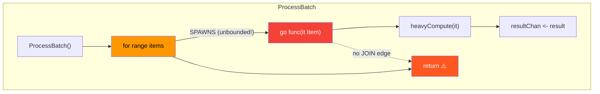
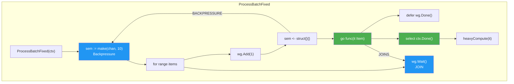
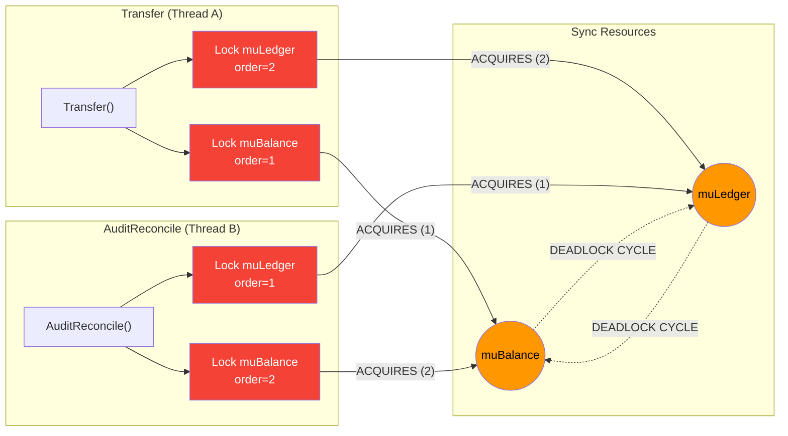
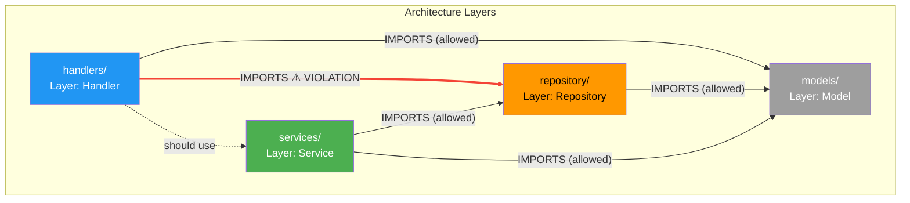
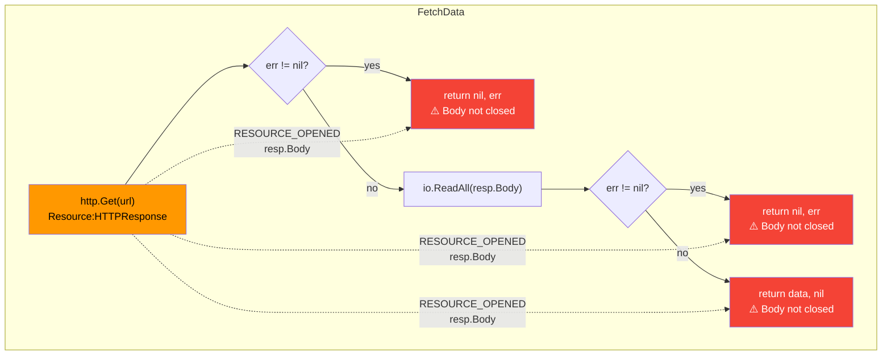
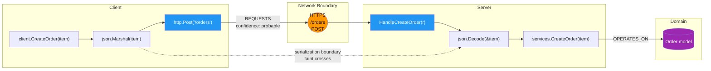

# Review: Customizable CodeFlow Analysis Rules

**Reviewer:** Claude
**Date:** 2026-03-09
**Document Under Review:** `docs/CodeFlow/customizable-analysis-rules.md`
**Cross-references:** MVP plan, backend architecture, anti-pattern detection, data flow design

---

## Table of Contents

1. [Executive Summary](#1-executive-summary)
2. [Missing Features & Edge Cases](#2-missing-features--edge-cases)
3. [Genericity Concerns](#3-genericity-concerns)
4. [Tree-sitter Feasibility Analysis](#4-tree-sitter-feasibility-analysis)
5. [Configuration Syntax Alternatives](#5-configuration-syntax-alternatives)
6. [Worked Examples with Mermaid Graphs](#6-worked-examples-with-mermaid-graphs)
7. [Recommendations Summary](#7-recommendations-summary)

---

## 1. Executive Summary

The customizable analysis rules document establishes a solid foundation: a generic engine that doesn't hardcode framework knowledge, structural signature matching, and graph mutations via tags/edges. However, several areas need attention:

- **The matching syntax is Go/OOP-centric** despite claiming language-agnosticism
- **No composition or inheritance model** for rules
- **Missing support for multi-node patterns** (matching a *shape* in the AST, not just a single call)
- **No scoping/context matching** (match only inside a loop, inside an error handler, etc.)
- **No negative matching** (match calls that do NOT have a corresponding cleanup)
- **No rule lifecycle** (versioning, deprecation, conflict resolution)
- **The tree-sitter integration is feasible but requires careful design** — raw tree-sitter queries are more powerful than the proposed glob syntax, and there's a tension between the two
- **YAML is workable but not ideal** — several alternatives are worth considering

---

## 2. Missing Features & Edge Cases

### 2.1 Multi-Statement Pattern Matching

The current design only matches individual call sites or type references. Real-world analysis needs to match *patterns across multiple statements*:

**Missing pattern: Resource acquire without release**
```
// We need to match: Lock() exists but Unlock() is missing in the same scope
mu.Lock()
// ... code ...
// no mu.Unlock() before return
```

**Missing pattern: Error value ignored**
```
// Match: call returns error, but caller discards it
result, _ := dangerousOperation()
```

**Missing pattern: Sequential API protocol**
```
// Match: Begin() must be followed by either Commit() or Rollback()
tx := db.Begin()
// ... operations ...
// no Commit() or Rollback() reachable
```

The rules doc has no mechanism to express "match X when Y is absent" or "match X followed by Y." This is arguably the most important gap — many real bugs are about *missing* code, not *present* code.

**Proposed addition — `pattern` blocks with multi-step matching:**
```yaml
rules:
  - id: "lock_without_unlock"
    pattern:
      - step: "acquire"
        match:
          signature: "*::*Mutex.Lock()"
          bind: "$mu"
      - step: "missing_release"
        absent_in_scope: true
        match:
          signature: "*::$mu.Unlock()"
    node:
      tags: ["Bug", "ResourceLeak"]
```

### 2.2 Context / Scope Constraints

There's no way to say "only match this pattern when inside a loop" or "only match when NOT inside a defer/finally." The `spawn_in_loop` rule in the MVP plan requires exactly this, but the rules doc doesn't provide the mechanism.

**Proposed addition — `context` constraints:**
```yaml
rules:
  - id: "spawn_in_loop"
    match:
      signature: "go::*($fn: Function)"
    context:
      inside: ["for_statement", "range_statement"]  # Tree-sitter node types
    node:
      tags: ["Concurrency", "UnboundedSpawn"]
```

```yaml
rules:
  - id: "allocation_in_hot_loop"
    match:
      signature: "*::make([]$type, *)"
    context:
      inside: ["for_statement"]
      not_inside: ["func_literal"]  # OK if it's a closure that escapes
    node:
      tags: ["Performance", "HotAllocation"]
```

### 2.3 Negative / Absence Matching

Many critical patterns are about what's *not there*:

- Context parameter not propagated
- Error not checked
- Channel not closed
- HTTP response body not closed
- Deferred cleanup missing

The doc has `terminates_execution` for control flow, but nothing for "this companion call must exist."

**Proposed addition — `requires` clause:**
```yaml
rules:
  - id: "http_body_not_closed"
    match:
      signature: "net/http::*Client.Do($req) -> ($resp, error)"
      bind_return: "$resp"
    requires:
      in_scope: true
      signature: "*::$resp.Body.Close()"
    on_missing:
      tags: ["Bug", "ResourceLeak"]
      severity: "high"
```

### 2.4 Rule Composition and Reuse

Rules can't reference other rules. If I define a "Source" tag and a "Sink" tag, there's no mechanism within the rules to say "find paths between Source and Sink." The doc defers this entirely to Cypher queries in the `visuals` block, but that splits the analysis definition across two disconnected systems.

**Proposed addition — `composed_rules`:**
```yaml
composed_rules:
  - id: "sql_injection"
    description: "User input reaches SQL execution without sanitization"
    path:
      from_tags: ["Source", "UserInput"]
      to_tags: ["Sink", "SQL"]
      must_pass_through: ["Sanitizer"]  # If absent, emit finding
    finding:
      severity: "critical"
      message: "Unsanitized user input flows to SQL sink"
```

### 2.5 Data Flow Direction and Propagation Rules

The `data_flow.track_field` for type unwrapping is useful but very narrow. Missing:

- **Propagation through function calls**: If `Validate(input)` returns a sanitized copy, how does the analyzer know the return value is "clean"?
- **Taint removal**: Which functions clear taint?
- **Taint propagation**: Which arguments propagate taint to the return value?

```yaml
rules:
  - id: "html_escape_sanitizer"
    match:
      signature: "html/template::*.HTMLEscapeString($input) -> $output"
    data_flow:
      sanitizes: ["XSS"]          # Removes XSS taint
      propagates: ["SQLi"]        # Does NOT remove SQL injection taint
      from: "$input"
      to: "$output"

  - id: "string_concat_propagates"
    match:
      signature: "fmt::*.Sprintf($format, ...$args) -> $result"
    data_flow:
      propagates_taint: true      # If any $arg is tainted, $result is tainted
      from: "$args"
      to: "$result"
```

### 2.6 Rule Versioning and Lifecycle

No mechanism for:
- Rule versioning (what happens when a rule definition changes?)
- Deprecation (replace `old_rule` with `new_rule`)
- Conflict resolution (two rules match the same call with contradictory tags)
- Rule priority/ordering

This matters for incremental analysis — changing a rule should invalidate affected findings, as noted in the MVP plan's `rule_version` property, but the rules doc doesn't define how version is tracked or how changes propagate.

### 2.7 Language-Specific Escape Hatches

The doc claims language-agnosticism but doesn't address language-specific constructs that have no cross-language equivalent:
- Go's `defer` (no equivalent in JS/Python in the same way)
- Python's `with` statement / context managers
- Rust's ownership/borrow semantics
- Java's `synchronized` blocks
- JavaScript's `async`/`await` coloring

**Proposed: language-specific matchers as an explicit extension point:**
```yaml
rules:
  - id: "missing_defer_unlock"
    match:
      signature: "*::*Mutex.Lock()"
    language: "go"
    requires:
      construct: "defer_statement"
      containing:
        signature: "*::*Mutex.Unlock()"
```

### 2.8 Missing: Structural / Architectural Rules

The doc focuses on call-site-level matching. Missing entirely:
- **Module/package dependency rules** (the anti-pattern doc covers this but the rules doc doesn't connect to it)
- **Cyclic dependency detection**
- **Public API surface constraints** ("this package should only export types implementing interface X")
- **Naming convention enforcement at structural level** ("handlers must live in `handler/` packages")

### 2.9 Missing: Quantitative Thresholds

- God type detection needs thresholds (field count, method count, coupling score)
- Fan-in/fan-out limits
- Cyclomatic complexity gates
- Function length limits that are context-aware (different limits for tests vs production)

```yaml
rules:
  - id: "god_type"
    match:
      type: "*::*"
    quantitative:
      field_count: { gt: 15 }
      method_count: { gt: 20 }
      coupling_packages: { gt: 5 }
    node:
      tags: ["Design", "GodType"]
```

### 2.10 Missing: Confidence and False-Positive Controls

No mechanism for:
- Setting confidence levels on rules
- Suppression annotations in source code (`// codeflow:ignore rule-id`)
- Per-rule false-positive rate tracking
- Adjustable sensitivity per rule

---

## 3. Genericity Concerns

### Where the doc is too specialized:

1. **The signature syntax is OOP-centric.** `Package::Receiver.Method(Args) -> Returns` assumes class-based dispatch. Doesn't naturally express:
   - Free functions in C/Rust/Go (no receiver)
   - Python decorators (`@app.route("/path")`)
   - Nested function definitions
   - Operator overloads
   - Macro invocations (Rust `macro_rules!`, C preprocessor)
   - Property access chains (`obj.a.b.c`)

2. **The examples are almost entirely Go-centric.** Every example uses Go packages (`database/sql`, `os`, `gin-gonic`). The one JS example uses Express but the syntax feels forced.

3. **Concurrency primitives assume goroutine/channel model.** Missing: thread pools, futures/promises, actor systems, reactive streams.

### Where the doc could be more generic:

1. **Replace "Receiver" with a more general "Target" concept** that encompasses receivers, modules, namespaces, and static classes.

2. **Add a "decorator/attribute" matcher** for annotation-driven frameworks:
   ```yaml
   rules:
     - id: "flask_route"
       match:
         decorator: "flask::*.route($path: StringLiteral)"
         on: "$handler: Function"
       emit:
         node:
           label: "APIHandler"
           properties:
             path: "$path"
   ```

3. **Add a "structural shape" matcher** that works on AST subtree shapes rather than call signatures — this is where tree-sitter's native query language becomes very relevant (see next section).

---

## 4. Tree-sitter Feasibility Analysis

### What tree-sitter can do well:

Tree-sitter's query language (S-expression patterns) is very capable for structural matching. It supports:

- **Node type matching**: `(call_expression)`, `(function_declaration)`
- **Field matching**: `(call_expression function: (identifier) @fn-name)`
- **Nested patterns**: Match a call inside a loop inside a function
- **Wildcards**: `(_)` matches any node
- **Quantifiers**: `(call_expression arguments: (argument_list (_)* @args))`
- **Predicates**: `(#eq? @fn-name "Lock")`, `(#match? @name "^Get.*")`
- **Alternations**: `[(if_statement) (switch_statement)] @control`
- **Anchoring**: `(block . (expression_statement) @first-stmt)`

### Where the proposed glob syntax maps to tree-sitter:

| Proposed Glob | Tree-sitter Query |
|---|---|
| `database/sql::*DB.Query(*)` | Requires symbol resolution beyond tree-sitter's scope |
| `*::*Mutex.Lock()` | `(call_expression function: (selector_expression field: (field_identifier) @method (#eq? @method "Lock")))` |
| `go func()` | `(go_statement (call_expression function: (func_literal)))` |

### The fundamental tension:

The glob syntax is **higher-level** than tree-sitter queries — it operates on resolved symbols, packages, and types. Tree-sitter operates on **syntax** — it knows about identifiers and structure but not about type resolution or package membership.

**Recommendation: Two-tier matching system.**

- **Tier 1 (Structural/Syntactic):** Tree-sitter queries for AST shape matching. This handles context constraints, multi-statement patterns, and structural shapes.
- **Tier 2 (Semantic/Resolved):** The proposed signature matching, which runs *after* symbol resolution. This handles package-qualified, type-resolved matching.

Both tiers should be available in rules:

```yaml
rules:
  - id: "goroutine_in_loop"
    match:
      # Tier 1: structural match via tree-sitter
      tree_sitter: |
        (for_statement
          body: (block
            (go_statement) @spawn))
    node:
      tags: ["Concurrency", "UnboundedSpawn"]

  - id: "sql_injection_sink"
    match:
      # Tier 2: semantic match via resolved symbols
      signature: "database/sql::*DB.Exec($query, ...$args)"
    node:
      tags: ["Sink", "SQL"]
```

### What tree-sitter CANNOT do (that the design needs to handle elsewhere):

1. **Cross-file analysis**: Tree-sitter parses one file at a time. Package resolution, type checking, and cross-file call graphs need the semantic layer.
2. **Type resolution**: `mu.Lock()` — tree-sitter doesn't know `mu` is a `sync.Mutex`. The symbol resolver must provide this.
3. **Data flow**: Tree-sitter sees assignments syntactically but can't track values through function calls.
4. **Control flow reachability**: Tree-sitter sees all branches but can't determine which are reachable.

### Verdict:

Tree-sitter is excellent for the syntactic layer and should be exposed directly in rules for structural pattern matching. But the semantic matching layer (signature syntax) is still necessary and operates on the resolved graph, not raw syntax. The key is making both available and composable.

---

## 5. Configuration Syntax Alternatives

### 5.1 YAML — Current Choice

**Pros:**
- Widely known, good tooling
- Easy to validate with JSON Schema
- Readable for simple cases

**Cons:**
- Verbose for complex patterns — deeply nested YAML becomes hard to read
- Whitespace-sensitive in surprising ways
- No native support for comments in values, multi-line strings are awkward
- String escaping issues (regex in YAML is painful)
- No type system — easy to make typos in field names
- Anchors/aliases are confusing

**Assessment:** Adequate for simple tag-and-edge rules. Breaks down for multi-step patterns, tree-sitter queries embedded in strings, or any rule with significant logic.

### 5.2 Starlark (Python-like DSL)

Used by Bazel, Buck2, and other build/config systems.

```python
# codeflow.star

rule(
    id = "sql_injection_sink",
    match = signature("database/sql::*DB.Exec($query, ...$args)"),
    tags = ["Sink", "SQL"],
)

rule(
    id = "goroutine_in_loop",
    match = tree_sitter("""
        (for_statement body: (block (go_statement) @spawn))
    """),
    tags = ["Concurrency", "UnboundedSpawn"],
)

# Composition is natural
sources = tag_group("Source", [
    signature("net/http::*Request.*"),
    signature("os::*.Getenv($key)"),
])

sinks = tag_group("Sink", [
    signature("database/sql::*DB.Exec(*)"),
    signature("os/exec::*.Command(*)"),
])

path_rule(
    id = "taint_flow",
    from_tags = sources,
    to_tags = sinks,
    must_pass_through = ["Sanitizer"],
    severity = "critical",
)
```

**Pros:**
- Familiar Python-like syntax
- Composable — variables, loops, functions
- Starlark is deterministic and sandboxed (no I/O, no infinite loops)
- Excellent for rule libraries and sharing
- Multi-line strings for embedded queries work naturally
- Type-checked at evaluation time

**Cons:**
- Requires a Starlark interpreter (Go implementations exist: `go.starlark.net`)
- Slightly higher learning curve than YAML
- Harder to generate programmatically

### 5.3 CUE

Used by Kubernetes/Dagger ecosystem. Superset of JSON with types, constraints, and composition.

```cue
package codeflow

rules: {
    sql_injection_sink: {
        match: signature: "database/sql::*DB.Exec($query, ...$args)"
        node: tags: ["Sink", "SQL"]
    }

    goroutine_in_loop: {
        match: tree_sitter: """
            (for_statement body: (block (go_statement) @spawn))
            """
        node: tags: ["Concurrency", "UnboundedSpawn"]
    }
}

// Type constraints prevent typos
#Rule: {
    id?:    string
    match:  #Matcher
    node?:  #NodeMutation
    edge?:  #EdgeMutation
}

#Matcher: {
    signature?:    string
    tree_sitter?:  string
    type?:         string
}
```

**Pros:**
- JSON superset — easy migration
- Built-in type system catches config errors at load time
- Composition and inheritance built in
- Go-native tooling (`cuelang.org/go`)
- Good for large, structured configs

**Cons:**
- Less well-known than YAML or Starlark
- The type system has a learning curve
- Overkill for simple rules

### 5.4 Custom DSL (Purpose-Built)

A tailored DSL that directly maps to CodeFlow concepts:

```
// codeflow.rules

@version("1")

// Simple tag rules
tag Sink.SQL on database/sql::*DB.Exec(*)
tag Sink.SQL on database/sql::*DB.Query(*)
tag Source.HTTP on net/http::*Request.*

// Structural match with tree-sitter
tag Concurrency.UnboundedSpawn on tree_sitter {
  (for_statement body: (block (go_statement) @spawn))
}

// Edge rules
edge SPAWNS from self to $fn
  on myapp/pool::*Worker.Submit($fn: Function)

// Multi-step pattern
pattern lock_without_unlock {
  acquire: *::*Mutex.Lock() bind $mu
  absent_in_scope: *::$mu.Unlock()
  => tag Bug.ResourceLeak
  => severity critical
}

// Path rules (composition)
path sql_injection {
  from Source.*
  to Sink.SQL
  unless Sanitizer.SQL
  => severity critical
  => message "Unsanitized input reaches SQL execution"
}

// Quantitative rules
threshold god_type on *::* {
  field_count > 15
  method_count > 20
  => tag Design.GodType
  => severity medium
}
```

**Pros:**
- Maximum conciseness — optimized for the exact problem
- Very readable for domain experts
- Eliminates all boilerplate
- Natural for the matching problem domain

**Cons:**
- Requires building and maintaining a parser
- No existing tooling (syntax highlighting, linting, LSP)
- Documentation burden
- Learning curve unique to this project

### 5.5 HCL (HashiCorp Configuration Language)

Used by Terraform, Vault, Consul.

```hcl
rule "sql_injection_sink" {
  match {
    signature = "database/sql::*DB.Exec($query, ...$args)"
  }

  node {
    tags = ["Sink", "SQL"]
  }
}

rule "goroutine_in_loop" {
  match {
    tree_sitter = <<-EOT
      (for_statement body: (block (go_statement) @spawn))
    EOT
  }

  context {
    inside = ["for_statement"]
  }

  node {
    tags = ["Concurrency", "UnboundedSpawn"]
  }
}
```

**Pros:**
- Well-suited for block-structured config
- Heredoc strings solve the embedded-query problem
- Go-native parser (`github.com/hashicorp/hcl`)
- Familiar to infrastructure engineers
- Good balance of readability and structure

**Cons:**
- Less composable than Starlark
- No built-in type system (though `hcldec` adds validation)

### 5.6 Recommendation

**Primary: Starlark** for rule definitions. Reasons:
- Best composability — rules can reference and build on each other
- Sandboxed execution — safe for user-defined rules
- Go-native implementation available
- Familiar syntax reduces learning curve
- Handles embedded tree-sitter queries naturally via multi-line strings

**Alternative: HCL** if the team prefers a purely declarative approach with no scripting.

**Avoid: Custom DSL** unless the team is prepared for ongoing language maintenance.

**Keep YAML** as an import/export format and for simple one-off rules, but don't make it the primary authoring format for complex analysis.

---

## 6. Worked Examples with Mermaid Graphs

### Example 1: SQL Injection Detection (Taint Flow)

**Source Code (Go):**
```go
package handlers

import (
    "database/sql"
    "fmt"
    "net/http"
)

func SearchHandler(w http.ResponseWriter, r *http.Request) {
    query := r.URL.Query().Get("q")           // SOURCE: user input
    filter := r.URL.Query().Get("filter")      // SOURCE: user input

    sanitizedFilter := sanitize(filter)         // SANITIZER

    // BUG: 'query' is not sanitized
    rows, _ := db.Query(
        fmt.Sprintf("SELECT * FROM items WHERE name = '%s' AND category = '%s'",
            query, sanitizedFilter))            // SINK: SQL

    writeResponse(w, rows)
}

func sanitize(input string) string {
    return strings.ReplaceAll(input, "'", "''")
}
```

**Rules:**
```yaml
rules:
  - id: "http_source"
    match:
      signature: "net/http::*Request.URL.Query().Get($key: StringLiteral)"
    node:
      identity_expansion: "$key"
      tags: ["Source", "UserInput", "HTTP"]

  - id: "sql_sink"
    match:
      signature: "database/sql::*DB.Query($q, ...$args)"
    node:
      tags: ["Sink", "SQL"]
    data_flow:
      taint_params: ["$q"]

  - id: "string_sanitizer"
    match:
      signature: "handlers::*.sanitize($input) -> $output"
    data_flow:
      sanitizes: ["SQL"]
      from: "$input"
      to: "$output"

  - id: "sprintf_propagates"
    match:
      signature: "fmt::*.Sprintf($format, ...$args) -> $result"
    data_flow:
      propagates_taint: true
      from: "$args"
      to: "$result"
```

**Output Graph:**



**Finding emitted:**
```
CRITICAL: sql_injection
  Path: r.URL.Query().Get("q") → fmt.Sprintf(...) → db.Query(...)
  Source: handlers/search.go:11 (HTTP query parameter "q")
  Sink: handlers/search.go:16 (SQL query execution)
  Missing: No sanitizer on path from "q" to SQL sink
  Note: Parameter "filter" IS sanitized via sanitize() — only "q" is exposed
```

---

### Example 2: Goroutine Leak Detection (Execution Flow)

**Source Code (Go):**
```go
package workers

func ProcessBatch(items []Item) {
    for _, item := range items {
        go func(it Item) {                    // SPAWN in loop (unbounded)
            result := heavyCompute(it)
            resultChan <- result              // Send to channel
        }(item)
    }
    // BUG: No WaitGroup, no channel drain, no context cancellation
    // Function returns, goroutines may still be running
}

func ProcessBatchFixed(ctx context.Context, items []Item) {
    var wg sync.WaitGroup
    sem := make(chan struct{}, 10)             // Bounded concurrency

    for _, item := range items {
        wg.Add(1)
        sem <- struct{}{}                     // Backpressure
        go func(it Item) {
            defer wg.Done()
            defer func() { <-sem }()
            select {
            case <-ctx.Done():
                return                        // Cancellation respected
            default:
                result := heavyCompute(it)
                resultChan <- result
            }
        }(item)
    }
    wg.Wait()                                 // JOIN point
}
```

**Rules:**
```yaml
rules:
  - id: "go_spawn"
    match:
      tree_sitter: |
        (go_statement (call_expression) @call)
    edge:
      type: "SPAWNS"
      from: "enclosing_function"
      to: "@call"

  - id: "spawn_in_loop"
    match:
      tree_sitter: |
        (for_statement
          body: (block (go_statement) @spawn))
    context:
      absent_sibling:
        any:
          - tree_sitter: "(call_expression function: (selector_expression field: (field_identifier) @m (#eq? @m \"Add\")))"
          - tree_sitter: "(send_statement)"     # semaphore pattern
    node:
      tags: ["Concurrency", "UnboundedSpawn"]

  - id: "waitgroup_join"
    match:
      signature: "sync::*WaitGroup.Wait()"
    control_flow:
      joins_spawns: true
    edge:
      type: "JOINS"
      from: "self"
      to: "enclosing_scope_spawns"
```

**Output Graph — Buggy version:**



**Output Graph — Fixed version:**



**Finding emitted (buggy version):**
```
CRITICAL: execution_unit_leak
  Spawn: workers/batch.go:5 (go func inside for-range loop)
  Issue: No reachable join point (WaitGroup.Wait, channel drain, or context cancellation)
  Aggravating: Spawn is inside loop — goroutine count is unbounded (O(len(items)))

HIGH: unbounded_spawn_in_loop
  Location: workers/batch.go:4-8
  Issue: go statement inside for-range with no semaphore or pool limiting concurrency
```

---

### Example 3: Lock Order Inversion (Concurrency Safety)

**Source Code (Go):**
```go
package account

var (
    muBalance sync.Mutex
    muLedger  sync.Mutex
)

// Thread A path
func Transfer(from, to *Account, amount int) {
    muBalance.Lock()         // Acquires Balance FIRST
    defer muBalance.Unlock()

    muLedger.Lock()          // Acquires Ledger SECOND
    defer muLedger.Unlock()

    from.Balance -= amount
    to.Balance += amount
    ledger.Record(from, to, amount)
}

// Thread B path — INVERTED ORDER
func AuditReconcile() {
    muLedger.Lock()          // Acquires Ledger FIRST
    defer muLedger.Unlock()

    muBalance.Lock()         // Acquires Balance SECOND
    defer muBalance.Unlock()

    // ... reconciliation logic
}
```

**Rules:**
```yaml
rules:
  - id: "mutex_acquire"
    match:
      signature: "sync::*Mutex.Lock()"
      bind_receiver: "$mu"
    edge:
      type: "ACQUIRES"
      from: "enclosing_function"
      to: "$mu"
      properties:
        order: "auto_increment_per_function"

  - id: "mutex_release"
    match:
      signature: "sync::*Mutex.Unlock()"
      bind_receiver: "$mu"
    edge:
      type: "RELEASES"
      from: "enclosing_function"
      to: "$mu"
```

**Composed pattern (anti-pattern query):**
```yaml
composed_rules:
  - id: "lock_order_inversion"
    query: |
      MATCH (f1:Function)-[a1:ACQUIRES]->(r1:SyncPrimitive)
      MATCH (f1)-[a2:ACQUIRES]->(r2:SyncPrimitive)
      WHERE a1.order < a2.order AND r1 <> r2
      MATCH (f2:Function)-[b1:ACQUIRES]->(r2)
      MATCH (f2)-[b2:ACQUIRES]->(r1)
      WHERE b1.order < b2.order AND f1 <> f2
      RETURN f1, f2, r1, r2
    severity: "critical"
    explain: |
      {{f1.name}} acquires {{r1.name}} then {{r2.name}}.
      {{f2.name}} acquires {{r2.name}} then {{r1.name}}.
      Concurrent execution causes potential deadlock.
```

**Output Graph:**



**Finding:**
```
CRITICAL: lock_order_inversion
  Path A: Transfer() acquires muBalance(1) → muLedger(2)
  Path B: AuditReconcile() acquires muLedger(1) → muBalance(2)
  Risk: Deadlock when Transfer and AuditReconcile run concurrently
  Fix: Establish consistent lock ordering (e.g., always muBalance before muLedger)
```

---

### Example 4: Architectural Layer Violation

**Source Code (Go):**
```go
// handlers/user.go — HTTP layer
package handlers

import (
    "myapp/models"        // OK: handlers can use models
    "myapp/repository"    // VIOLATION: handlers should go through services
    "net/http"
)

func GetUser(w http.ResponseWriter, r *http.Request) {
    id := r.URL.Query().Get("id")
    // BUG: Bypasses service layer, goes directly to repository
    user, err := repository.FindUserByID(id)   // VIOLATION
    writeJSON(w, user)
}
```

**Rules:**
```yaml
rules:
  - id: "layer_handler"
    match:
      package: "myapp/handlers/**"
    node:
      tags: ["Layer:Handler"]
      properties:
        layer: "handler"

  - id: "layer_service"
    match:
      package: "myapp/services/**"
    node:
      tags: ["Layer:Service"]
      properties:
        layer: "service"

  - id: "layer_repository"
    match:
      package: "myapp/repository/**"
    node:
      tags: ["Layer:Repository"]
      properties:
        layer: "repository"

  - id: "layer_model"
    match:
      package: "myapp/models/**"
    node:
      tags: ["Layer:Model"]
      properties:
        layer: "model"

composed_rules:
  - id: "layer_violation"
    query: |
      MATCH (h:Package {layer: "handler"})-[:IMPORTS]->(r:Package {layer: "repository"})
      RETURN h, r
    severity: "high"
    explain: "Handler package {{h.path}} directly imports repository package {{r.path}}, bypassing the service layer."

layer_policy:
  allowed_dependencies:
    handler:  [service, model]
    service:  [repository, model]
    repository: [model]
    model: []
```

**Output Graph:**



---

### Example 5: HTTP Response Body Resource Leak

**Source Code (Go):**
```go
package client

func FetchData(url string) ([]byte, error) {
    resp, err := http.Get(url)
    if err != nil {
        return nil, err
    }
    // BUG: resp.Body is never closed
    // Missing: defer resp.Body.Close()

    data, err := io.ReadAll(resp.Body)
    if err != nil {
        return nil, err     // Leaks resp.Body on this path too
    }
    return data, nil
}
```

**Rules (using multi-step pattern matching — proposed extension):**
```yaml
rules:
  - id: "http_response_source"
    match:
      signature: "net/http::*.Get($url) -> ($resp, error)"
    node:
      tags: ["Resource", "HTTPResponse"]
      bind_return: "$resp"

  - id: "http_body_close"
    match:
      signature: "*::$resp.Body.Close()"
    node:
      tags: ["ResourceRelease"]

patterns:
  - id: "http_body_leak"
    description: "HTTP response body opened but never closed"
    steps:
      - acquire:
          signature: "net/http::*.Get(*) -> ($resp, error)"
          or: "net/http::*Client.Do(*) -> ($resp, error)"
      - required_release:
          signature: "*::$resp.Body.Close()"
          scope: "function"          # Must appear in same function
          prefer: "defer_statement"  # Should be in a defer
    on_missing_release:
      severity: "high"
      tags: ["Bug", "ResourceLeak", "HTTPBody"]
      message: "HTTP response body is never closed — connection will leak"
    on_non_deferred_release:
      severity: "medium"
      tags: ["Warning", "ResourceLeak"]
      message: "resp.Body.Close() is called but not deferred — early returns may leak"
```

**Output Graph:**



**Finding:**
```
HIGH: http_body_leak
  Resource: resp.Body opened at client/fetch.go:4
  Return paths without Close():
    - client/fetch.go:7 (error return)
    - client/fetch.go:12 (error return)
    - client/fetch.go:14 (success return)
  Fix: Add `defer resp.Body.Close()` after the nil-error check
```

---

### Example 6: Cross-Service Data Flow (API Boundary Bridge)

**Source Code:**

```go
// client/api.go
package client

func CreateOrder(item Item) (*Order, error) {
    payload, _ := json.Marshal(item)
    resp, err := http.Post("https://api.example.com/orders",
        "application/json", bytes.NewReader(payload))
    // ...
}
```

```go
// server/handlers/orders.go
package handlers

func HandleCreateOrder(w http.ResponseWriter, r *http.Request) {
    var item Item
    json.NewDecoder(r.Body).Decode(&item)

    // item.Name comes from user — is it sanitized before DB write?
    order := services.CreateOrder(item)
    // ...
}
```

**Rules (using semantic mappings):**
```yaml
# codeflow.semantic.yaml
bridges:
  - id: "orders_api"
    client:
      signature: "client::*.CreateOrder($item)"
      url_pattern: "*/orders"
      method: "POST"
    server:
      signature: "handlers::*.HandleCreateOrder(*)"
      route: "/orders"
      method: "POST"
    edge:
      type: "REQUESTS"
      data_flow:
        maps:
          - client_param: "$item"
            server_param: "$item"  # via JSON serialization boundary
            confidence: "probable"

endpoint_types:
  - handler: "handlers::*.HandleCreateOrder"
    operates_on: "models::Order"
    edge_type: "OPERATES_ON"
```

**Output Graph:**



---

## 7. Recommendations Summary

### Must-Have Additions (before v1)

| # | Feature | Why |
|---|---|---|
| 1 | **Multi-statement pattern matching** | Most real bugs are about missing code, not present code |
| 2 | **Context/scope constraints** | `spawn_in_loop` requires this; the MVP plan needs it but the rules doc doesn't provide it |
| 3 | **Negative/absence matching** | Resource leaks, missing error checks, missing cleanup |
| 4 | **Data flow propagation/sanitization** | Without this, taint analysis can't work through function calls |
| 5 | **Two-tier matching (tree-sitter + semantic)** | Expose tree-sitter queries directly; don't force everything through glob syntax |
| 6 | **Confidence levels on rules** | Critical for reducing noise and enabling graduated rollout |

### Should-Have Additions (v1.x)

| # | Feature | Why |
|---|---|---|
| 7 | **Rule composition** | Rules should reference each other; path queries should be first-class |
| 8 | **Starlark or HCL as primary config** | YAML breaks down for complex rules |
| 9 | **Quantitative thresholds** | God type, fan-in/fan-out, complexity — needs numeric constraints |
| 10 | **Source-code suppression annotations** | Teams need per-line/per-function overrides |
| 11 | **Language-specific matchers** | `defer`, `with`, `async/await` need explicit support |
| 12 | **Layer policy declaration** | Architectural rules need a proper allowed-dependency matrix |

### Nice-to-Have (v2+)

| # | Feature | Why |
|---|---|---|
| 13 | **Rule marketplace/registry** | Share rules across projects and teams |
| 14 | **AI-assisted rule suggestion** | Analyze codebase patterns and suggest rules |
| 15 | **Rule testing framework** | Test rules against fixture code before deploying |
| 16 | **Rule performance profiling** | Some graph queries can be expensive; need visibility |

### On the Config Format Question

- **Use YAML for simple rules** (tag this call, add this edge)
- **Adopt Starlark for complex rules** (multi-step patterns, composition, conditional logic)
- **Expose tree-sitter queries directly** in both formats as embedded strings
- Consider having a `codeflow convert` tool that migrates YAML rules to Starlark as they grow complex
